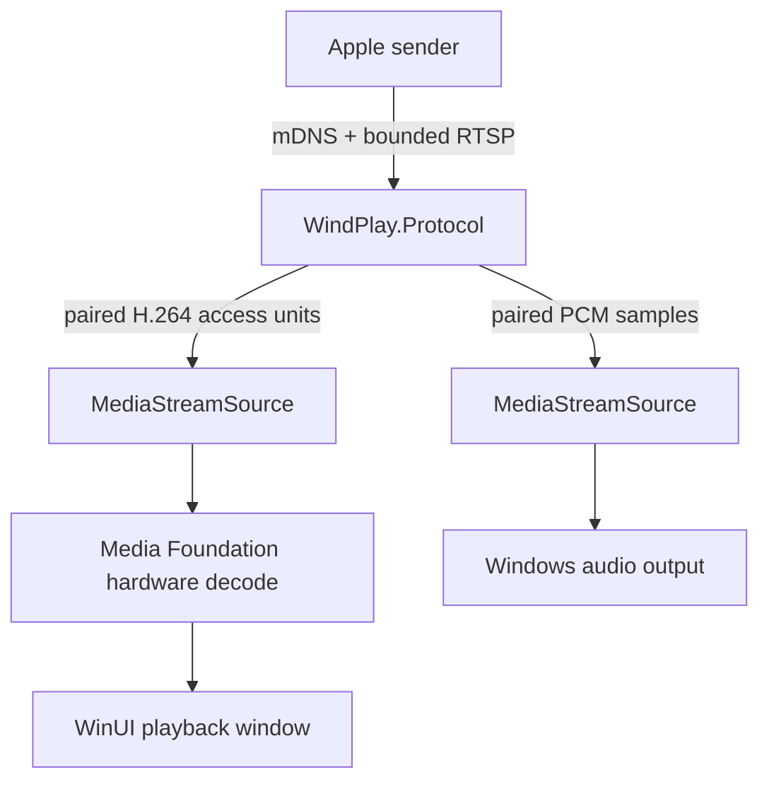

# Architecture

WindPlay is a native ARM64 WinUI 3 application. It keeps protocol, UI, and platform playback concerns separate so untrusted LAN input is parsed and bounded before it reaches Windows media APIs.

## Trust boundaries

- Discovery and listeners accept private, loopback, and IPv4 link-local addresses by default. The current media transport is IPv4-only.
- The `_airplay._tcp` and `_raop._tcp` records intentionally share one hardened RTSP listener, matching current receiver behavior and avoiding an extra open port.
- RTSP headers and bodies have fixed size and count limits; malformed data closes only that peer.
- Failed passcode responses are rate-limited across reconnects by sender address.
- Media sockets accept packets only from the IP address that created the paired RTSP session.
- A random per-install Ed25519 seed is protected with Windows DPAPI at `CurrentUser` scope.
- The passcode is also DPAPI-protected. Authentication responses are compared in constant time.
- Compressed H.264 stays compressed until it reaches Media Foundation. A three-frame bounded queue favors current frames over latency accumulation.
- No incoming content is written to disk.

## Dependencies and licensing

The receiver protocol began as a fork of MIT-licensed AirPlay.Core2. WindPlay avoids the GPL/GStreamer stack and x64-only FFmpeg/AAC binaries, keeping the Windows ARM64 distribution native and leaving future distribution options open. See `THIRD_PARTY_NOTICES.md` and generated NuGet lock files for the exact dependency graph.
