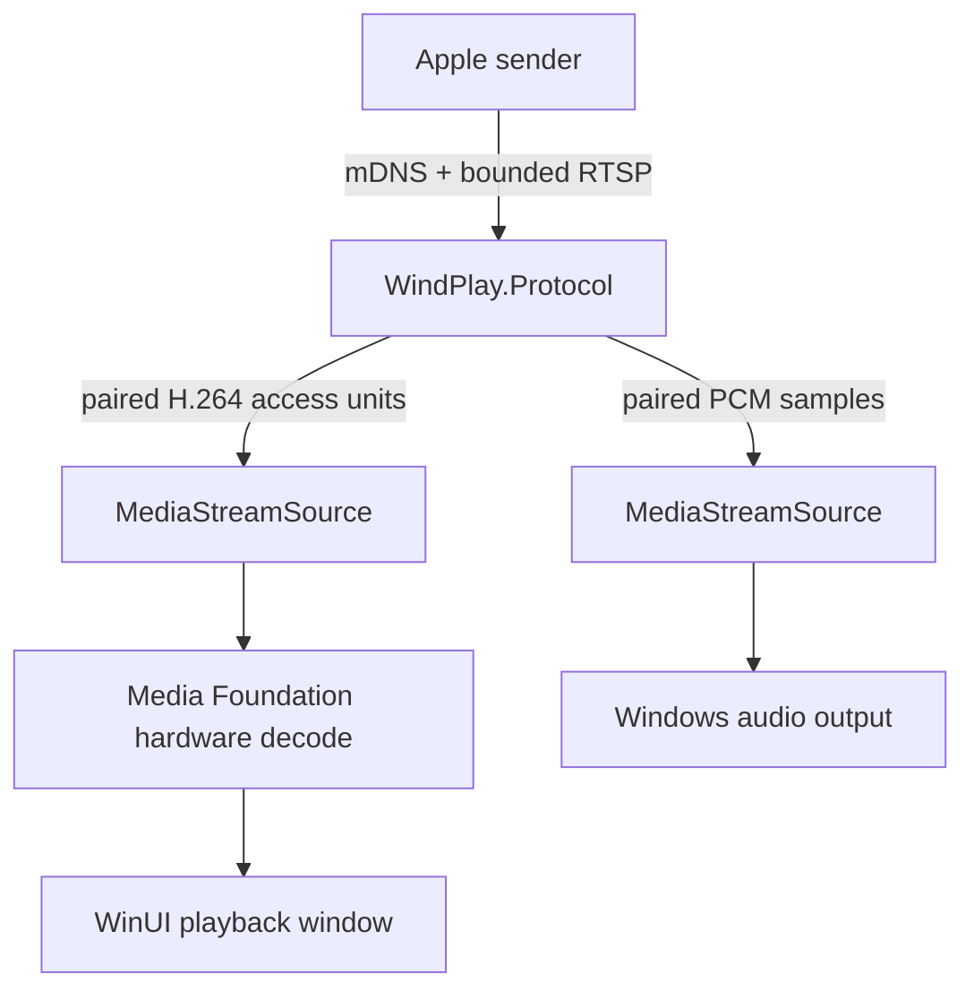

# Architecture

WindPlay is a native ARM64 WinUI 3 application. It keeps protocol, UI, and platform playback concerns separate so untrusted LAN input is parsed and bounded before it reaches Windows media APIs.

## Trust boundaries

- One directly attached private IPv4 Ethernet/Wi-Fi interface is selected on startup. RTSP and mirror TCP bind its address, and RTSP peers must match its actual prefix. mDNS joins that interface only and checks the receiving interface index and peer prefix before parsing. Routed/public access is disabled.
- The `_airplay._tcp` and `_raop._tcp` records intentionally share one hardened RTSP listener, matching current receiver behavior and avoiding an extra open port.
- RTSP has an 8-KiB fixed header buffer and route-specific body admission before a single body allocation. Header/idle, body, progress and write deadlines apply to every session. Fixed-capacity per-source and global rate/byte budgets bound repeated work.
- All inbound plists use the binary-only bounded parser; the generic plist library is used for output object construction and serialization only. Cycles, object/reference/offset errors, deep graphs and expansion budgets are rejected.
- mDNS uses an iterative bounded decoder, a 9,000-byte datagram cap and record/name/pointer limits. No discovery library receive path remains. Only active paired DACP sessions retain endpoints, for at most 120 seconds and at most 16 entries; packet source, session IP and A record must agree.
- Failed password responses are rate-limited across reconnects by sender address and globally. Legacy Digest is retained; the default secret now has 100 bits rather than 10,000 possibilities.
- Media sockets accept packets only from the IP address that created the paired RTSP session.
- A random per-install Ed25519 seed is protected with Windows DPAPI at `CurrentUser` scope.
- The passcode is also DPAPI-protected. Authentication responses are compared in constant time.
- Compressed H.264 stays compressed until it reaches Media Foundation. A three-frame bounded queue favors current frames over latency accumulation.
- Mirror payloads are bounded by type (2 MiB frame, 64 KiB configuration) before renting buffers. Both header dimensions and SPS coded surfaces are limited to a 4K pixel budget; unsupported profiles, large reference counts and unknown NAL classes are rejected. Media decoders remain in-process and are not an isolation boundary.
- No incoming content is written to disk.

## Dependencies and licensing

The receiver protocol began as a fork of MIT-licensed AirPlay.Core2. WindPlay avoids the GPL/GStreamer stack and x64-only FFmpeg/AAC binaries, keeping the Windows ARM64 distribution native and leaving future distribution options open. See `THIRD_PARTY_NOTICES.md` and generated NuGet lock files for the exact dependency graph.
